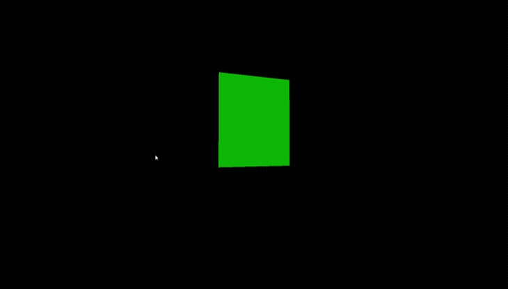
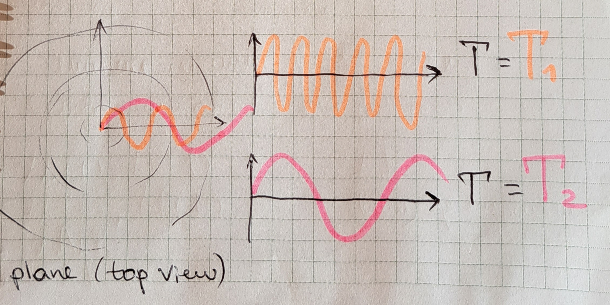

Vulkan Real-Time Grass Rendering
======================

## Demo rendering

## Introduction

Another individual inspired by [NVIDIA’s paper](https://www.cg.tuwien.ac.at/research/publications/2017/JAHRMANN-2017-RRTG/JAHRMANN-2017-RRTG-draft.pdf).

Probably the primary objective was to experiment with hardware-based optimization though. All the GPGPU stuff is exciting but I’m here to focus on leveraging the full potential of the GPU. For instance, the specification states that Vulkan only guarantees 128 bytes for push constants size, but all the per-frame updating matrices require 64 * 3 = 192 bytes. Therefore, we have to use uniform buffers and memory mapping to provide data to shaders. And I’m not fond of this approach since low-level APIs are actually called ‘low-level’ for a reason! I haven’t seen anyone using if-else statements for memory organization, probably because almost every GPGPU programmer has an NVIDIA GPU so can’t appreciate how FPS truly increases with push constants. It’s not entirely safe to use them, but since Vulkan does provide information about the available size, why not? Pipeline configuration can also be set during creation (using specialization constants), so there is no issue with if-else statement when choosing between push constants and memory mapping. Once it helped me inrease my FPS from 400 to almost 900. I simply preferred re-recording command buffers with per-frame updating push constants. Splitting compute shader and experimenting with different workgroup sizes are other aspects I could mention. It’s high time we started using low-level APIs as they were actually low-level. 

So, before launching the project in your environment, consider checking device_context.hpp since all the GPU-related data is described there. 

## Environment

* Windows 10
* Visual Studio
* Intel Integrated UHD Graphics 620
> as I mentioned above, I don’t have a discrete GPU and I see this as an absolute win.

## Culling demo

### Orientation test

enabled|disabled
----|---
|

### View-Frustum test

enabled|disabled
----|---
|

### Distance test

enabled|disabled
----|---
|

## Math Behind Each Blade
Geometric interpretation of each formula given in the paper.

I hope all the ✨ paintings ✨ will help you understand the formulas. If you have any questions, feel free to ask me.

Please note that only rendering part is shown, as the physics intuition doesn’t directly belong to the blade’s model and can be studied through better examples available on YouTube.
I assume that you have complited reading the paper before going through this article because I only provide images and no textual eplanation, as they already exist.

### Basic parameters 

### The blade mid point

### Orientation test

### Why should you use trigonometric functions with different frequences to simulate wind coming from a specific source, like a helicopter or a fan? Take a look.

### Things are getting quite messy... I didn’t have enough colors, so tried using special symbols such as different types of hearts to help you distinguish one vector from another.

### Tessellation interpolation

## Implementation details

### Indirect Rendering
Again, there are lots of resources, so I’m only going to mention the reasons why I used that technique.

This time we can’t know the exact parameters of each draw call at the time that our application builds its command buffers. In most cases, having access to the parameters of drawing commands is a natural part of the application though. The overall structure of the geometry is known, but the exact number of vertices and locations of data in the vertex buffer is not known, such as when a blade can be culled if doesn’t pass a test. 
 
## In advance

Since the tessellation pipeline is being used, you probably can’t help using one extra feature, can you? So what I’m thinking about is to make the vertices amount vary depending on the camera distance. Using a vertex, view and projection matrices it’s feasible to calculate the distance value.

Aside from Vulkan possibilities, adding collision detection would be a significant enhancment. I omitted the interpretation of the formulas since they weren’t utilized. 
I don’t really think it would have been useful if I had described all the Vulkan-side details since there are a lot of tutorials online.

### A heart for those who do appreciate!

## Resources

The following links may be useful for this project.

* [Responsive Real-Time Grass Grass Rendering for General 3D Scenes](https://www.cg.tuwien.ac.at/research/publications/2017/JAHRMANN-2017-RRTG/JAHRMANN-2017-RRTG-draft.pdf)
* [CIS565 Vulkan samples](https://github.com/CIS565-Fall-2018/Vulkan-Samples)
* [Official Vulkan documentation](https://www.khronos.org/registry/vulkan/)
